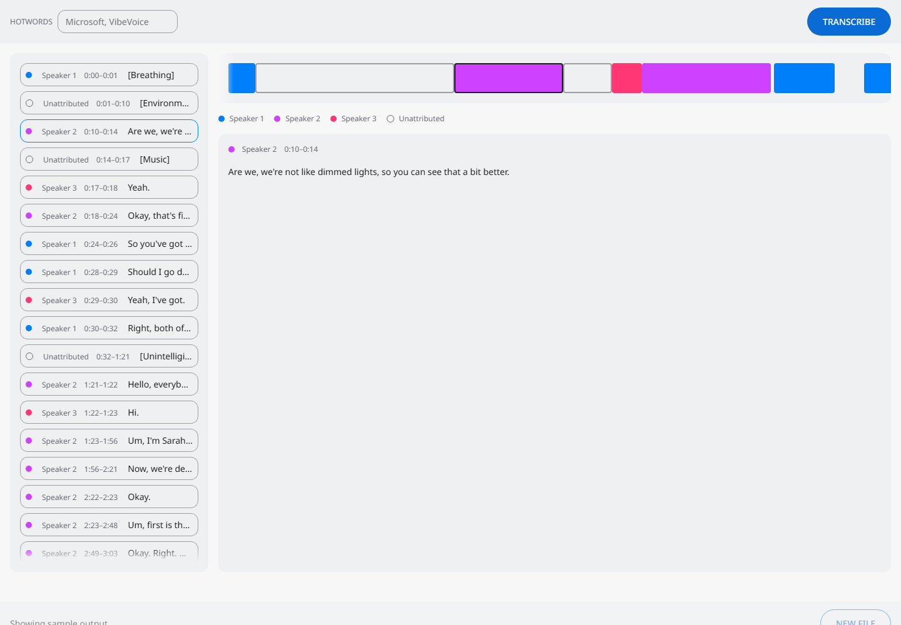

# 세 머신에서 돌린 VibeVoice-ASR

## 1. 무엇인가

회의를 받아 적으면서 누가 말했는지 표시하고 모든 구간에 타임스탬프를 붙이는 Microsoft의
음성 인식 모델이다. 최대 60분 길이의 오디오를 한 번에 처리한다.

## 2. 무엇이 다른가

두 가지이고, 아래 벤치마크가 실제로 다루는 것은 두 번째다.

**7.5 Hz 토크나이저.** 24000 Hz 오디오를 hop length 3200으로 압축해 초당 7.5개 토큰으로
만든다. 그래서 한 시간 분량의 음성이 프레임 단위 모델이라면 수십만 개가 될 토큰 대신
27000개의 음향 토큰이 된다. 한 시간이 컨텍스트 윈도우 안에 들어갈 수 있는 이유가 이것이다.

```
24000 Hz audio ─▶ acoustic tokenizer ─┐
                                      ├─▶ Qwen2 decoder ─▶ text, speaker, timestamps
                  semantic tokenizer ──┘   28 layers, hidden 3584, 4 key-value heads
                     both at 7.5 Hz
```

**파이프라인이 아니라 한 번의 디코딩.** 보통은 받아 적는 모델과 별도의 화자 분리 모델을
돌린 뒤 두 출력을 맞춘다. 여기서는 한 번의 디코딩에서 단어, 화자, 시각이 함께 나온다.
아래 정확도 절이 word error rate만이 아니라 tcpWER을 보고하는 이유다. word error rate는
이 모델이 내놓는 것의 3분의 1만 채점한다.

체크포인트는 8,674,021,857개 파라미터, `bfloat16` 기준 17.35 GB이고 모듈별로 고르게
나뉘어 있지 않다.

| 모듈 | 크기 | 비중 |
|---|---|---|
| `model.language_model` | 14.14 GB | 81.5% |
| `model.acoustic_tokenizer` | 1.37 GB | 7.9% |
| `lm_head` | 1.09 GB | 6.3% |
| `model.semantic_tokenizer` | 0.69 GB | 4.0% |
| 커넥터 | 0.06 GB | 0.4% |

추정치가 아니라 체크포인트의 가중치 인덱스에서 직접 읽은 값이다. 5절에서 이 값이 중요해진다.

## 3. 무엇을 만들었나

`releases/speaker-diarization-vibevoice`는 모델을 HTTP 엔드포인트와 웹 인터페이스에 연결하는
`model-compose.yml`이다. 오디오 파일을 올리고 필요하면 핫워드를 넣으면, 화자별로 색이
구분된 구간 목록과 타임라인이 나온다.



화면의 샘플 데이터는 손으로 쓴 픽스처가 아니라 이 리포트의 AMI 실측 결과다. 이렇게 바꾸면서
손으로 쓴 픽스처가 가리고 있던 결함 두 개가 드러났다. 모델은 화자가 없는 비음성 이벤트를
별도 구간으로 내보내는데 이것이 `Speaker NaN`으로 렌더링됐고, 인터페이스에는 구간의 전체
텍스트를 읽을 곳이 없었다. 목록은 텍스트를 자르고, 옆 패널에는 타임라인만 있었다.

발견하기 전에 밝혀둘 캡처 한계가 있다. `position: fixed` 콘텐츠는 화면에 실제로 열려 있어도
헤드리스 캡처에 그려지지 않는다. 그래서 여기 실린 미디어는 제대로 캡처되는 상태, 즉 팝오버가
닫힌 상태를 기준으로 연출했다.

## 4. 성능

모든 머신에서 같은 오디오 파일 하나를 썼다. AMI 회의 ES2004a, 헤드셋 믹스, 1049.35초
(17.5분), 화자 4명이며 AMI 코퍼스에서 내려받았다.

| 머신 | 런타임 | 빌드 | 수치 형식 | 콜드 스타트 | TTFO | E2E | RTF | 최대 가속기 메모리 | 최대 상주 메모리 |
|---|---|---|---|---|---|---|---|---|---|
| RTX 4090 | model-compose + pytorch 2.11.0+cu128 | `microsoft/VibeVoice-ASR` | `bfloat16` | 17.50 s | = E2E | 233.53 s | **0.223** | 22134 MB | 3064 MB |
| DGX Spark (GB10) | model-compose + pytorch 2.14.0+cu130 | `microsoft/VibeVoice-ASR` | `bfloat16` | 94.76 s | = E2E | 1023.93 s | **0.976** | 23777 MB | 3456 MB |
| MacBook Air M1 | mlx-audio | `mlx-community/VibeVoice-ASR-4bit` | `int4/mlx`, 토크나이저와 커넥터 제외 | 4.60 s | 225.36 s | 1134.33 s | **1.081** | 13852 MB | 5957 MB |

**4090은 17.5분짜리 회의를 4분 안에 받아 적는다. Spark는 17.1분이 걸려 직접 듣는 것보다
겨우 빠르고, M1은 실시간보다 느리다.** RTF 1.0 미만이면 라이브 오디오를 따라잡을 수 있는데,
셋 중 여유 있게 따라잡는 머신은 하나뿐이다.

TTFO와 E2E가 다른 머신은 M1뿐이다. MLX 빌드는 디코딩하면서 텍스트를 스트리밍하므로 18.9분
실행 중 3.8분 만에 첫 단어가 나온다. `model-compose` 워크플로우는 출력을 `as json`으로
선언해 완성된 값을 한 번에 돌려주므로, 두 열이 같은 것은 속도 때문이 아니라 구조 때문이다.

세 열은 행마다 의미가 달라지고, 표는 그 사실을 감출 수 없다.

| 열 | 이 행들 사이에서 |
|---|---|
| 콜드 스타트 | 비교 불가. 러너가 둘이고 하나는 compose 스택을 올리고 하나는 모델만 로드한다. M1은 5.71 GB를 로드하고 나머지는 17.35 GB를 로드한다 |
| RTF, E2E | 실제로 받는 성능으로는 비교 가능하지만 하드웨어 순위로는 비교 불가 |
| 메모리 | 4090은 비디오 메모리, Spark와 M1은 시스템과 공유하는 통합 메모리 |

M1 행은 나머지 두 행과 같은 측정이 아니다. CUDA에서 레퍼런스 체크포인트를 돌린 것이 아니라
Metal 커널에서 4-bit MLX 변환본을 돌렸다. 그래서 M1과 Spark의 차이에는 하드웨어와 빌드가
섞여 있고, 이 표는 둘을 분리하지 못한다. 이 행이 보여주는 것은 16 GB 노트북에서도 332 MB의
스왑만으로 이 모델이 돌아간다는 사실이다.

### 길이가 늘면 비용은 선형보다 더 늘어난다

같은 머신, 같은 모델, 두 가지 오디오 길이다.

| 오디오 | RTF | 최대 비디오 메모리 |
|---|---|---|
| 60 s | 0.111 | 19298 MB |
| 1049 s | 0.223 | 22134 MB |

오디오가 17배 길어지자 RTF는 두 배가 되고 메모리는 2.8 GB 늘었다. 어텐션은 시퀀스 길이의
제곱으로, key-value 캐시는 선형으로 커진다. 이 디코더의 key-value 캐시는 토큰당 57.3 KB다.
따라서 "60분을 한 번에"라는 주장은 컨텍스트 윈도우에 들어간다는 뜻이지 비용이 일정하다는
뜻이 아니다.

### 정확도

모든 머신의 전사 결과를 같은 회의의 AMI 수동 단어 주석과 대조해 MeetEval로 채점했다. 원래
세 대를 모두 채점할 계획은 아니었다. 처음 두 대의 결과가 서로 달랐기 때문에 계획이 바뀌었다.

| 머신 | 수치 형식 | WER | cpWER | tcpWER | 구간 수 |
|---|---|---|---|---|---|
| RTX 4090 | `bfloat16` | 17.88% | 17.51% | 18.18% | 152 |
| DGX Spark | `bfloat16` | 17.66% | 17.17% | 17.51% | 153 |
| MacBook M1 | `int4/mlx` | 17.47% | 17.28% | 17.66% | 149 |
| *공개 수치* | *`ami_test`* | *17.20%* | *없음* | *없음* | — |

**같은 체크포인트를 같은 정밀도로 돌린 두 머신이 서로 다른 전사 결과를 냈다.** `bfloat16`은
정밀도가 낮아서 커널이나 연산 순서가 달라지면 토큰 하나가 뒤집히고, 뒤집힌 토큰 하나가 그
뒤의 디코딩 전체를 바꾼다. 4090은 AD102에서 PyTorch 2.11.0+cu128을, Spark는 GB10에서
2.14.0+cu130을 돌렸다. GB10은 `sm_121`이고 aarch64용 cu128 휠이 없기 때문이다. 따라서
같은 가중치, 같은 입력이면 같은 출력이 나오니 정확도는 한 번만 재면 된다는 흔한 가정은 여기서
성립하지 않는다. 차이는 노이즈로 봐도 될 만큼 작지만, 그것은 가정이 아니라 측정으로 얻은
결론이다.

**4-bit 빌드가 가장 나쁜 행이 아니다.** 세 수치 모두 `bfloat16` 두 머신이 이미 만든 범위
안에 들어가고, WER로는 셋 중 가장 좋다. 4-bit 양자화가 이 모델의 단어 정확도에서 깎은 것이
무엇이든, 레퍼런스 체크포인트를 돌린 CUDA 머신 두 대 사이의 차이보다 작다. `mlx-community`는
변환 빌드 중 어느 것에도 평가 수치를 공개하지 않으므로, 이 리포트에서 이런 종류의 수치는
이것 하나뿐이다.

이 결론은 기준선이 둘 있었기에 나왔다. 하나만 쟀다면 공개 수치 17.20% 대비 17.47%는 0.27%p의
양자화 손실로 읽혔을 것이다.

**공개 수치 17.20% 대비 17.88%는 발견이 아니라 셋업이 맞다는 확인이다.** `microsoft/VibeVoice-ASR-HF`
모델 카드의 Open ASR Leaderboard 표는 `ami_test` 17.20%, 8개 데이터셋 평균 7.77%, RTFx
51.80을 제시한다. AMI는 그 표에서 가장 나쁜 행이지만 회의 전사기가 바로 AMI가 재는 대상이므로
본문에 둔다. 리더보드는 미리 잘라둔 발화를 채점하고, 여기서는 회의 전체를 한 번에 디코딩했으니
더 어려운 문제다. 모델 카드는 그 행이 어떤 마이크 조건인지도 밝히지 않는다. 조건이 이만큼
다른데도 결과가 이만큼 가깝다는 것은 파이프라인이 제대로 돌았다는 뜻이다. 모델이 엉터리를
내놓았어도 위의 시간 수치는 똑같아 보였을 테니, 이것을 잰 이유가 바로 이 확인이다.

**모든 머신에서 tcpWER은 cpWER과 0.67%p 이내이고, 그 차이가 타임스탬프 오차의 크기다.**
시간 제약을 더해도 점수가 거의 움직이지 않으므로, 모델은 단어를 자기가 말한 위치 근처에
배치한다. 두 지표 모두 공개된 비교 수치가 없다.

레퍼런스와 가설 양쪽에 똑같이 두 가지 정규화를 적용했다.

| 단계 | 효과 |
|---|---|
| `EnglishTextNormalizer` | Open ASR Leaderboard가 적용하는 정규화기 |
| 비음성 구간 제외 | 179개 중 26개. `[Breathing]`, `[Music]` 같은 것으로, AMI는 이를 전사하지 않으므로 남겨두면 각각 삽입된 단어로 채점된다 |

### 공개된 RTFx는 이 표의 RTF가 아니다

리더보드의 RTFx 51.80은 RTF 0.0193의 역수다. 여기서 4090은 RTF 0.223, 즉 RTFx 4.49를
기록했다. 12배 차이지만 조건이 거의 겹치지 않는다. 짧게 잘린 클립과 17.5분 단일 처리, 배치
처리량과 `batch: 1`, 그들의 하드웨어와 우리의 하드웨어. 두 수치는 같은 리포트에 있어야 하지만
같은 열에 있어서는 안 된다.

## 5. 한계

**60분은 컨텍스트 윈도우에 대한 주장이지 메모리에 대한 주장이 아니다.** 17.5분에서 이미
24564 MB 카드의 22134 MB를 썼다. key-value 캐시가 토큰당 57.3 KB씩 늘어나므로, 27000개
음향 토큰에 텍스트까지 더한 한 시간 분량은 24 GB에 들어가지 않는다. 이 머신이 모델 카드가
말하는 일을 해낼 수 있는지는 이번 실행으로 결론 나지 않은 질문이다.

**6 GB 카드로는 양자화해도 돌릴 수 없다.** 6141 MiB의 RTX 4050 Laptop은 실행 실패가 아니라
계산으로 표에서 빠졌다. 백본을 `nf4`로 양자화하면 3.65 GB가 남고, 양자화하면 파형 복원이
망가지는 모듈이 3.21 GB를 더해, 활성값 하나 올리기 전에 가중치만 6.86 GB로 6.00 GB를 넘는다.
`lm_head`까지 양자화해도 6.05 GB다. 들어가는 구성은 시스템 메모리로 오프로드하는 것뿐인데,
그러면 머신이 아니라 오프로드를 재게 된다.

**16 GB Mac에는 변환 빌드가 필요하다.** `mlx-community`는 `bf16` 17.35 GB, 8-bit 9.52 GB,
4-bit 5.71 GB 빌드를 공개한다. 여기서는 4-bit 빌드가 332 MB 스왑으로 돌아갔다.
bitsandbytes는 CUDA 커널만 컴파일하므로 이 빌드를 만들 수 없다. 그래서 경로는 MLX이고, 그
결과로 나온 행은 CUDA 행과 직접 비교할 수 없다.

**두 머신은 같은 PyTorch를 돌릴 수 없다.** GB10은 `sm_121`이라 CUDA 13이 필요하고, aarch64용
cu128 휠은 공개되지 않았다. 4090과 Spark 사이 1.6 GB 메모리 차이의 일부는 하드웨어가 아니라
빌드 몫이며, 이번 실행은 둘을 분리하지 않는다.

**라이선스와 사용 범위.** 모델 카드는 다음과 같이 밝힌다.

> "This project is licensed under the MIT License."
>
> 번역: "이 프로젝트는 MIT 라이선스로 배포된다."

사용 범위 밖의 용도, 배포 제한, 책임 있는 AI 관련 제약은 명시하지 않는다. 확인하지 않은
항목과 확인했더니 비어 있던 항목은 밝히지 않으면 똑같이 읽히므로, 그 부재를 여기에 적어 둔다.

## 6. 링크

| 항목 | 위치 |
|---|---|
| 예제 | `releases/speaker-diarization-vibevoice` |
| 모델 카드 | https://huggingface.co/microsoft/VibeVoice-ASR |
| 리더보드 수치 | https://huggingface.co/microsoft/VibeVoice-ASR-HF |
| 기술 리포트 | https://arxiv.org/abs/2601.18184 |
| Open ASR Leaderboard | https://arxiv.org/abs/2510.06961 |
| MeetEval | https://github.com/fgnt/meeteval |
| AMI 코퍼스 | https://groups.inf.ed.ac.uk/ami/corpus/ |
| 이 리포트로 작성한 X 포스트 | `releases/speaker-diarization-vibevoice/social.md` |
