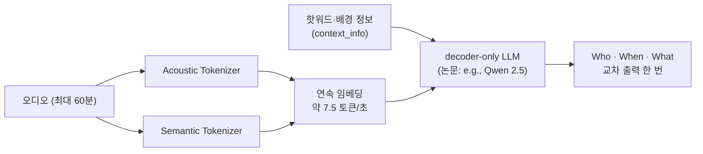

# VibeVoice-ASR 긴 회의 전사 리포트

## 1. 한 줄 정의

`microsoft/VibeVoice-ASR`는 최대 60분 길이의 오디오를 한 번에 받아, 누가(화자)·언제(타임스탬프)·무엇을(내용) 말했는지를 하나의 생성 결과로 내놓는 Microsoft의 음성 인식 모델이다.

## 2. 무엇이 다른가

첫째, 전사·화자 분리·타임스탬프가 하나의 디코딩이다. 기존 파이프라인이 VAD, ASR, diarization 모델을 이어 붙이는 것과 달리, 논문은 이 모델이 "unifies Automatic Speech Recognition, Speaker Diarization, and Timestamping into a single end-to-end generation task"라고 설명한다. 출력은 "a structured sequence that explicitly interleaves speaker identity ('Who'), temporal boundaries ('When'), and speech content ('What')"이다.

둘째, 오디오를 청크로 잘라 따로 판단하지 않는다. Acoustic Tokenizer와 Semantic Tokenizer가 오디오를 초당 약 7.5 토큰의 연속 임베딩으로 줄이고, 이 낮은 토큰율 덕분에 60분 오디오가 64K 토큰 컨텍스트 하나에 들어간다. 내부적으로는 60초 단위로 인코딩하지만 합성곱 상태를 이어 받아 청크 경계에서 컨텍스트가 끊기지 않는다(예제 `README.md`의 "How it works").

출처: [arXiv:2601.18184](https://arxiv.org/abs/2601.18184), [`microsoft/VibeVoice-ASR` 모델 카드](https://huggingface.co/microsoft/VibeVoice-ASR).

## 3. 무엇을 만들었나

`model-compose` 예제 `speaker-diarization-vibevoice`는 오디오 파일 하나를 떨어뜨리면 `transcribe-meeting` 워크플로우를 WebSocket으로 호출하고, 돌아온 `{ text, start_time, end_time, speaker_id }` 세그먼트를 화자별 색상 타임라인과 세그먼트 목록으로 동시에 그린다. 타임라인은 실제 시작·종료 시각에 맞춰 배치되므로 대본을 읽지 않고도 누가 얼마나 길게, 누구 말을 끊고 말했는지가 보인다. 핫워드 입력란은 도메인 용어를 `context_info`로 모델에 넘긴다.

이 스크린샷은 라이브 서버가 아니라 `ui/fixture.json`으로 렌더링한 화면이다(하단 "Showing sample output"). fixture의 세그먼트는 아래 4장의 RTX 4090 실행 전사(`benchmarks/transcripts/rtx-4090.json`) 앞부분과 같다. 두 번째 발화가 "so you can see"로, DGX Spark 전사의 "so people can see"가 아니라 4090 쪽과 일치한다.

데모 영상은 이번에 만들지 않았다. 녹화하게 되면 헤드리스 캡처의 한계를 알고 시작해야 한다. `position: fixed`로 뜨는 팝오버(드롭다운 메뉴, 색상 선택기)는 화면에 열려 있어도 헤드리스 `screenshot`이나 screencast 프레임에 그려지지 않는 경우가 많다. 이 화면에는 그런 팝오버가 없지만, 나중에 추가된다면 닫힌 상태나 선택 결과가 이미 반영된 상태로 녹화 흐름을 짜야 한다.

## 4. 성능

### 조건

| 항목 | 값 | 출처 |
|---|---|---|
| 입력 오디오 | AMI `ES2004a` 한 세션 전체, 1049.35초(약 17분 29초) | `benchmarks/results/*.json`의 `conditions.audio_duration_seconds`, 전사 끝 시각과 `benchmarks/transcripts/ES2004a.reference.json` |
| 배치 | 1 | `conditions.batch` |
| 음향 토크나이저 청크 | 1,440,000 샘플 | `conditions.acoustic_tokenizer_chunk_size` |
| 워크플로우 설정 | `precision: auto`, `attn_implementation: sdpa`, `temperature: 0.0`, `num_beams: 1`, `streaming: false` | `model-compose.yml` |

### 머신별 속도와 메모리

| 머신 | 런타임 | 빌드 | 수치 형식 | 콜드 스타트 | TTFO | E2E | RTF | 최대 VRAM | 최대 RSS |
|---|---|---|---|---|---|---|---|---|---|
| RTX 4090 | `model-compose + pytorch 2.11.0+cu128` | `microsoft/VibeVoice-ASR` | `bfloat16` | 17.50 s | 233.53 s | 233.53 s | 0.2225 | 22,134 MB | 3,064 MB |
| DGX Spark | `model-compose + pytorch 2.14.0+cu130` | `microsoft/VibeVoice-ASR` | `bfloat16` | 94.76 s | 1023.93 s | 1023.93 s | 0.9758 | 23,777 MB | 3,456 MB |
| MacBook M1 | `mlx-audio` | `mlx-community/VibeVoice-ASR-4bit` | `int4/mlx, all but acoustic_tokenizer and semantic_tokenizer and acoustic_connector and semantic_connector, compute bfloat16` | 4.60 s | 225.36 s | 1134.33 s | 1.081 | 13,852.5 MB | 5,957 MB |

출처: `benchmarks/results/rtx-4090.json`, `dgx-spark.json`, `macbook-m1.json`. 세 실행 모두 `valid: true`, `errors: []`.

RTF는 RTX 4090이 0.22로 가장 빠르다. 17분 29초짜리 회의를 3분 54초에 끝냈으니 실시간보다 약 4.5배 빠르다. DGX Spark는 같은 체크포인트, 같은 `bfloat16`으로 17분 4초가 걸려 RTF 0.98, 실시간과 거의 같은 속도였다. 두 CUDA 머신은 수치 형식과 빌드가 같지만 PyTorch·CUDA 버전(`2.11.0+cu128` 대 `2.14.0+cu130`)이 다르므로, 이 4.4배 차이를 순수한 GPU 성능 차이로 읽을 수는 없다. 이 표만으로는 하드웨어와 소프트웨어 스택의 몫을 나누지 못한다.

MacBook M1은 4-bit MLX 변환본을 `mlx-audio`로 돌린 결과다. 4-bit MLX 변환본을 돌린 맥은 `bfloat16` PyTorch 체크포인트를 돌린 4090보다 E2E가 약 4.9배 길었고, RTF 1.08로 실시간보다 조금 느렸다. 이 차이에는 하드웨어, 빌드, 추론 스택이 함께 섞여 있고 이 표로는 셋을 분리할 수 없다.

런타임이 다른 행끼리는 세 열의 의미가 달라진다.

| 열 | 런타임이 다를 때 |
|---|---|
| 콜드 스타트 | 비교 불가. `model-compose` 행은 virtualenv 컴포넌트를 띄워 모델을 올리는 시간이고, `mlx-audio` 행은 다른 방식으로 스택을 올린 시간이다. 맥의 4.60 s가 빠르다는 뜻이 아니다 |
| TTFO, E2E, RTF | 실제로 받는 성능으로는 비교 가능, 하드웨어 순위로는 비교 불가 |
| 정확도 | 비교 불가. 같은 구현이 느리게 도는 것이 아니라 다른 구현이다 |

TTFO는 두 PyTorch 행에서 E2E와 같다. `streaming: false`라 결과가 한 번에 나오기 때문이다. 맥 행의 TTFO 225.36 s는 `mlx-audio`가 토큰을 흘려 보내는 첫 시점이라 PyTorch 행의 TTFO와 같은 사건이 아니다.

메모리는 VRAM과 RSS를 함께 봐야 한다. RTX 4090은 전용 VRAM이 있는 카드라 두 수치가 다른 메모리를 가리키고, 가중치는 VRAM 쪽 22,134 MB에 있다. DGX Spark(128GB unified LPDDR5X, [NVIDIA](https://www.nvidia.com/en-us/products/workstations/dgx-spark/))와 MacBook M1은 통합 메모리라 VRAM과 RSS가 같은 바이트를 두 번 셀 수 있다. 두 수치를 더해 총 사용량으로 읽으면 안 된다. 맥의 VRAM 열은 `mlx.core.get_peak_memory()` 계열의 MLX 피크이고, 4-bit 변환본의 공개 크기는 5.71 GB다([모델 카드](https://huggingface.co/mlx-community/VibeVoice-ASR-4bit)).

VRAM 수치에는 한 가지 확인하지 못한 점이 있다. 이 예제의 컴포넌트는 `runtime: type: virtualenv`로 별도 프로세스에서 모델을 올리므로, 벤치마크 러너 자신의 프로세스에서 읽은 CUDA 메모리는 0이어야 한다. 결과 파일의 값은 0이 아니므로 다른 경로로 읽혔다고 보이지만, 어느 프로세스에서 어떤 API로 읽었는지는 결과 파일에 기록되어 있지 않다.

RTF는 오디오 길이에 따라 달라진다. 같은 RTX 4090에서 60초 스모크 실행(`benchmarks/results/rtx-4090-smoke.json`, `bfloat16`, 배치 1)은 RTF 0.1109였고, 1049.35초 실행은 0.2225였다. 그래서 위 표의 RTF는 17분 29초 오디오에서만 유효하고, 한 시간짜리 녹음 시간을 여기서 곱해 추정해서는 안 된다.

이 표는 `precision: auto`가 CUDA에서 고른 `bfloat16` 그대로의 결과다. `benchmark.md`가 권하는 `float16` 강제 실행으로 맞춘 비교표는 측정하지 않았다. 두 CUDA 행은 이미 같은 `bfloat16`이라 서로 수치 형식이 맞고, 설치한 그대로 받는 성능이기도 하므로 표 하나를 본문에 두었다. MPS에서 `auto`가 고르는 `float16`으로 `model-compose`를 돌린 맥 행은 없다.

### 정확도

채점은 `meeteval`로 했고, 정규화기는 `transformers EnglishTextNormalizer`, tcpWER collar는 5.0초다. 기준 전사는 `ES2004a` 한 세션, 2,505 단어다. 결과 파일에는 마이크 조건(IHM 헤드셋 믹스인지 SDM 원거리 마이크인지)이 기록되어 있지 않아 이 리포트도 적지 않는다.

기준 체크포인트 두 머신(같은 `microsoft/VibeVoice-ASR`, 같은 `bfloat16`, 같은 `model-compose + pytorch` 스택):

| 머신 | 런타임 | 수치 형식 | tcpWER | cpWER | WER | 출력 세그먼트 | 제외한 비음성 세그먼트 |
|---|---|---|---|---|---|---|---|
| RTX 4090 | `model-compose + pytorch 2.11.0+cu128` | `bfloat16` | 18.18% | 17.51% | 17.88% | 152 | 26 |
| DGX Spark | `model-compose + pytorch 2.14.0+cu130` | `bfloat16` | 17.51% | 17.17% | 17.66% | 153 | 23 |
| 두 머신 차이 | | | 0.67 pt | 0.33 pt | 0.22 pt | | |

출처: `benchmarks/accuracy/accuracy-rtx-4090.json`, `accuracy-dgx-spark.json`.

같은 가중치, 같은 수치 형식인데도 두 머신의 전사가 달랐다. 앞부분에서 한 머신은 "so you can see", 다른 머신은 "so people can see"로 받아 적었고, 이런 토큰 하나의 차이가 이후 디코딩을 바꿔 tcpWER로 0.67 pt 벌어졌다. 이 폭이 이 세션에서의 잡음 바닥이다. 이보다 작은 차이를 정밀도나 양자화 탓으로 돌리면 안 된다.

머리 지표는 tcpWER이다. 이 모델은 전사, 화자, 시간을 한 번에 내놓으므로 WER은 그 절반만 채점한다. cpWER과 tcpWER의 차이(4090 0.67 pt, DGX Spark 0.34 pt)가 타임스탬프 오차의 크기이고, 5초 collar 안에서는 작다. WER은 전사만 하는 모델과 비교하기 위해 함께 적는다.

MLX 4-bit 변환본(별도 구현, 위 표와 비교 불가):

| 머신 | 런타임 | 빌드 | 수치 형식 | tcpWER | cpWER | WER | 출력 세그먼트 |
|---|---|---|---|---|---|---|---|
| MacBook M1 | `mlx-audio` | `mlx-community/VibeVoice-ASR-4bit` | `int4/mlx, all but acoustic_tokenizer and semantic_tokenizer and acoustic_connector and semantic_connector, compute bfloat16` | 17.66% | 17.28% | 17.47% | 149 |

출처: `benchmarks/accuracy/accuracy-macbook-m1.json`.

`mlx-community/VibeVoice-ASR-4bit` 모델 카드는 정확도 평가를 하나도 싣지 않는다. 그래서 위 행은 이 변환본에 대해 공개된 유일한 점수다. 다만 PyTorch 체크포인트와는 커널, 연산 융합, 양자화 구현이 모두 다른 코드가 낸 점수다. 기준 두 머신 사이 폭 안에 들어간다는 사실을 "4-bit 양자화에 손실이 없다"는 근거로 읽으면 안 된다. 한 세션, 한 번의 실행으로는 그 판단을 뒷받침할 수 없다.

### 공개 수치와의 대조

| 공개 수치 | 값 | 이 측정과 다른 점 |
|---|---|---|
| Open ASR Leaderboard `ami_test` WER ([`microsoft/VibeVoice-ASR-HF`](https://huggingface.co/microsoft/VibeVoice-ASR-HF)) | 17.20% | 카드는 행 이름을 `ami_test`로만 적고 마이크 조건을 밝히지 않는다. 리더보드는 미리 잘라 둔 발화 단위로 채점하고, 이 측정은 17분 29초 회의 한 개를 통째로 넣었다. 채점기도 리더보드 하네스가 아니라 `meeteval`이다 |
| 논문 Table 2, AMI-IHM ([arXiv:2601.18184](https://arxiv.org/abs/2601.18184)) | DER 11.92, cpWER 20.41, tcpWER 20.82, WER 18.81 | 논문은 평가 세션, collar, 정규화기, 긴 녹음 통째 여부를 밝히지 않는다 |
| 논문 Table 2, AMI-SDM | DER 13.43, cpWER 28.82, tcpWER 29.80, WER 24.65 | 위와 같다 |

로컬 WER 17.66–17.88%는 리더보드의 `ami_test` 17.20%와 0.5–0.7 pt 차이다. 더 어려운 통짜 긴 녹음 조건에서 채점했다는 점을 감안하면 하네스 설정이 틀렸다고 볼 거리는 없다. 논문의 AMI tcpWER과는 조건이 확인되지 않으므로 수치를 나란히 두기만 하고, 로컬 결과가 어느 마이크 조건에 가깝다는 결론은 내리지 않는다.

`ami_test` 17.20%는 리더보드 8개 데이터셋 중 가장 나쁜 행이다(평균 7.77%, `librispeech_test.clean` 2.20%). 이 데모의 도메인이 바로 회의이므로 평균이 아니라 이 행이 이 데모에 해당하는 수치다.

## 5. 한계

### 모델이 못 하는 것

논문이 스스로 적은 한계는 두 가지다.

- 겹치는 발화: "The current architecture generates a serialized output stream and does not explicitly handle overlapping speech (the 'cocktail party problem')." (번역: 현재 구조는 직렬화된 출력 스트림을 생성하며 겹치는 발화('칵테일 파티 문제')를 명시적으로 처리하지 않는다.) 회의에서 두 사람이 동시에 말하는 구간은 한 줄로 합쳐지거나 한쪽이 빠질 수 있다.
- 언어: "the SFT phase predominantly focused on English, Chinese, and code-switching data. Consequently, the model may experience performance degradation on low-resource languages absent from the instruction tuning stage." (번역: SFT 단계는 주로 영어, 중국어, 코드 스위칭 데이터에 집중했다. 따라서 지시 튜닝 단계에 없던 저자원 언어에서는 성능이 떨어질 수 있다.)

### 주의할 점

- 이 리포트의 정확도는 영어 회의 한 세션(`ES2004a`, 2,505 단어)에서 나온 수치다. 두 CUDA 머신만으로 tcpWER이 0.67 pt 흔들렸으므로, 세션 하나의 점수를 모델의 일반적인 회의 정확도로 옮기면 안 된다.
- 출력에는 `[Breathing]`, `[Music]`, `[Unintelligible Speech]` 같은 비음성 세그먼트가 `speaker_id` 없이 섞여 나온다. 채점에서는 머신별로 22–26개를 제외했다. 화면은 이를 "Unattributed"로 표시한다.
- 이 예제 그대로(`model-compose` + PyTorch)는 Apple Silicon에서 측정하지 않았다. 표의 MacBook M1 행은 이 예제가 아니라 `mlx-audio`로 `mlx-community/VibeVoice-ASR-4bit`를 직접 돌린 결과다. 맥 사용자가 실제로 쓸 수 있는 것으로 확인된 빌드는 이쪽이다. 그 출력은 `{ Start, End, Speaker, Content }` 형태의 JSON 텍스트라서 `model-compose` 워크플로우가 돌려주는 `{ text, start_time, end_time, speaker_id }`와 다르다.
- 맥 행의 RTF는 1.08로 실시간보다 느리다. 17분 29초 녹음에 18분 54초가 걸렸다.
- RTX 4090 실행의 최대 VRAM은 22,134 MB였다. 4090의 전용 메모리가 24GB라 여유가 크지 않고, 이보다 긴 녹음에서 얼마나 늘어나는지는 측정하지 않았다.

### 라이선스와 사용 범위

라이선스는 MIT다([`microsoft/VibeVoice-ASR` 모델 카드](https://huggingface.co/microsoft/VibeVoice-ASR), [`mlx-community/VibeVoice-ASR-4bit` 모델 카드](https://huggingface.co/mlx-community/VibeVoice-ASR-4bit)).

`microsoft/VibeVoice-ASR` Hugging Face 모델 카드와 GitHub의 [`docs/vibevoice-asr.md`](https://github.com/microsoft/VibeVoice/blob/main/docs/vibevoice-asr.md)에는 사용 범위 제한 문구가 없다. 확인하고 없다는 뜻이다. 이 모델을 담고 있는 [`microsoft/VibeVoice`](https://github.com/microsoft/VibeVoice) 저장소 README에는 아래 "Risks and Limitations" 절이 있다. 이 절은 ASR을 따로 지목하지 않고, 합성 음성과 TTS 쪽 베이스 모델(Qwen2.5 1.5b)을 언급하는 저장소 전체 문구다. 그래도 같은 저장소가 이 모델을 배포하므로 원문 그대로 옮긴다.

> While efforts have been made to optimize it through various techniques, it may still produce outputs that are unexpected, biased, or inaccurate. VibeVoice inherits any biases, errors, or omissions produced by its base model (specifically, Qwen2.5 1.5b in this release).
> Potential for Deepfakes and Disinformation: High-quality synthetic speech can be misused to create convincing fake audio content for impersonation, fraud, or spreading disinformation. Users must ensure transcripts are reliable, check content accuracy, and avoid using generated content in misleading ways. Users are expected to use the generated content and to deploy the models in a lawful manner, in full compliance with all applicable laws and regulations in the relevant jurisdictions. It is best practice to disclose the use of AI when sharing AI-generated content.
>
> We do not recommend using VibeVoice in commercial or real-world applications without further testing and development. This model is intended for research and development purposes only. Please use responsibly.

번역: 여러 기법으로 최적화하려 노력했지만, 여전히 예상치 못하거나 편향되거나 부정확한 출력을 낼 수 있다. VibeVoice는 베이스 모델(이번 릴리스에서는 Qwen2.5 1.5b)이 만든 편향, 오류, 누락을 그대로 물려받는다. 딥페이크와 허위 정보 가능성: 고품질 합성 음성은 사칭, 사기, 허위 정보 유포를 위한 그럴듯한 가짜 오디오를 만드는 데 악용될 수 있다. 사용자는 전사가 신뢰할 만한지 확인하고, 내용의 정확성을 점검하며, 생성된 콘텐츠를 오해를 부르는 방식으로 쓰지 않아야 한다. 사용자는 해당 관할권의 모든 법규를 완전히 준수하는 합법적인 방식으로 생성 콘텐츠를 사용하고 모델을 배포해야 한다. AI 생성 콘텐츠를 공유할 때는 AI 사용 사실을 밝히는 것이 바람직하다.

추가 테스트와 개발 없이 VibeVoice를 상업용이나 실제 서비스에 쓰는 것을 권장하지 않는다. 이 모델은 연구 개발 목적으로만 만들어졌다. 책임감 있게 사용하라.

MIT 라이선스가 상업적 사용을 허락한다는 사실과, 저자가 추가 테스트 없는 실사용을 권하지 않는다는 사실은 동시에 참이다. 이 리포트의 수치는 둘 중 어느 쪽도 바꾸지 않는다.

## 6. 링크

| 대상 | 링크 |
|---|---|
| 예제 | [`releases/speaker-diarization-vibevoice`](https://github.com/<owner>/<repository>/tree/releases/speaker-diarization-vibevoice/releases/speaker-diarization-vibevoice) |
| 모델 카드 | [`microsoft/VibeVoice-ASR`](https://huggingface.co/microsoft/VibeVoice-ASR) |
| 모델 카드 (Transformers, Open ASR Leaderboard 표) | [`microsoft/VibeVoice-ASR-HF`](https://huggingface.co/microsoft/VibeVoice-ASR-HF) |
| MLX 변환본 | [`mlx-community/VibeVoice-ASR-4bit`](https://huggingface.co/mlx-community/VibeVoice-ASR-4bit) |
| 논문 | [VibeVoice-ASR Technical Report, arXiv:2601.18184](https://arxiv.org/abs/2601.18184) |
| 모델 저장소 | [`microsoft/VibeVoice`](https://github.com/microsoft/VibeVoice) |
| 채점기 | [MeetEval](https://github.com/fgnt/meeteval), [Open ASR Leaderboard](https://github.com/huggingface/open_asr_leaderboard) |
