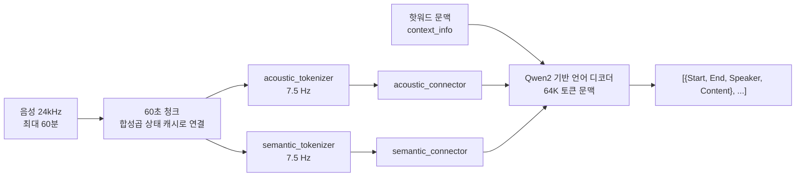
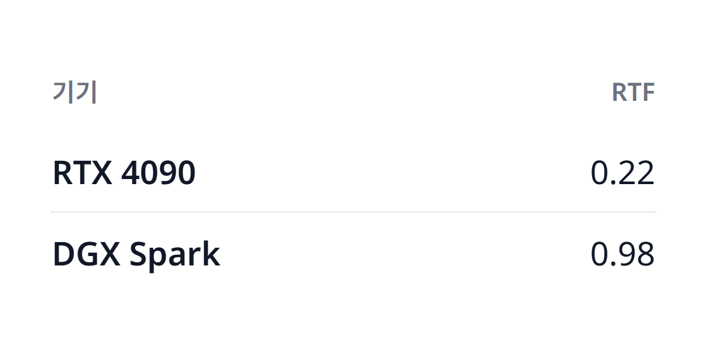
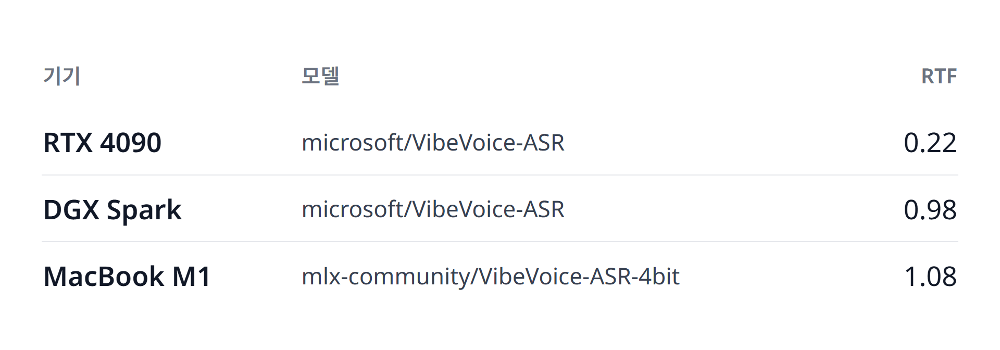

# VibeVoice-ASR 화자 분리 전사 리포트

## 1. 한 줄 정의

`microsoft/VibeVoice-ASR`은 최대 60분 길이의 음성을 한 번에 입력받아 전사, 화자 분리, 타임스탬프를 하나의 생성 과정으로 함께 출력하는 Microsoft의 음성 인식 모델이다.

## 2. 무엇이 다른가

두 가지가 다르다.

| 차이점 | 내용 | 출처 |
|---|---|---|
| 청크 없는 단일 패스 | 7.5 Hz로 동작하는 연속 음성 토크나이저 덕분에 60분 음성이 64K 토큰 문맥 하나에 들어간다. 토크나이저 내부에서는 60초(24kHz 기준 1440000 샘플) 단위로 나누어 처리하지만, 청크 사이의 합성곱 상태를 캐시로 넘기므로 언어 모델은 녹음 전체를 끊김 없는 하나의 구간으로 본다 | [microsoft/VibeVoice](https://github.com/microsoft/VibeVoice) README, [Transformers 문서](https://huggingface.co/docs/transformers/main/en/model_doc/vibevoice_asr) |
| 전사·화자·시간을 한 번에 생성 | 전사 모델 뒤에 화자 분리 모델을 잇는 파이프라인이 아니라, 언어 디코더가 `Start`, `End`, `Speaker`, `Content`를 담은 JSON 형태 문자열을 직접 생성한다. 도메인 용어를 위한 문맥(핫워드)도 프롬프트로 넣을 수 있다 | [arXiv:2601.18184](https://arxiv.org/abs/2601.18184) 초록, Transformers 문서 |

두 토크나이저와 두 커넥터가 언어 디코더와 분리된 모듈이라는 점은 4절의 4-bit 변환본에서 다시 중요해진다. 그 변환본은 이 네 모듈을 양자화에서 제외했다.

## 3. 무엇을 만들었나

`model-compose.yml` 하나로 `microsoft/VibeVoice-ASR`을 `transcribe-meeting` 워크플로로 띄우고, 정적 웹 UI(`http://localhost:8081`)가 WebSocket으로 그 워크플로를 호출한다. 오디오 파일 하나를 끌어다 놓으면 `{ text, start_time, end_time, speaker_id }` 세그먼트 목록이 돌아오고, 화면은 이를 두 가지로 그린다.

| 영역 | 보여주는 것 |
|---|---|
| 상단 타임라인 | 세그먼트를 실제 시작·종료 시각 위치에 화자별 색 블록으로 배치한다. 누가 얼마나 길게 말했는지, 어디서 말이 끊겼는지가 글을 읽지 않아도 보인다 |
| 좌측 세그먼트 목록 | 화자, 시간 구간, 문장. 화자 색은 타임라인과 같다 |
| 우측 상세 | 선택한 세그먼트의 전체 문장 |
| 상단 입력 | `context_info`로 넘어가는 핫워드 입력칸 |

스크린샷은 UI에 들어 있는 샘플 출력(`ui/fixture.json`)을 띄운 상태로, 하단에 "Showing sample output"이 표시된다. `[Music]`, `[Environmental Sounds]`처럼 모델이 화자를 붙이지 않은 비음성 세그먼트는 `Unattributed`로 따로 표시된다.

헤드리스 캡처에서는 `position: fixed`로 띄우는 팝오버(드롭다운 메뉴, 색 선택기)가 실제로 열려 있어도 찍히지 않는다. 이 UI에는 그런 팝오버가 없으므로 스크린샷에서 빠진 상태는 없다. 데모 영상은 만들지 않았다.

## 4. 성능

### 측정 조건

| 조건 | 값 |
|---|---|
| 입력 | AMI 회의 세션 `ES2004a` 전체, 1049.35초(17분 29초) 한 파일 |
| 배치 | 1 |
| `acoustic_tokenizer_chunk_size` | 1440000 |
| 출처 | `benchmarks/results/<machine>.json` |

### 기기별 속도와 메모리

| 머신 | 런타임 | 빌드 | 수치 형식 | 콜드 스타트 | TTFO | E2E | RTF | 최대 VRAM | 최대 RSS |
|---|---|---|---|---|---|---|---|---|---|
| RTX 4090 | `model-compose + pytorch 2.11.0+cu128` | `microsoft/VibeVoice-ASR` | `bfloat16` | 17.50 s | 233.53 s | 233.53 s | 0.2225 | 22,134 MB | 3,064 MB |
| DGX Spark | `model-compose + pytorch 2.14.0+cu130` | `microsoft/VibeVoice-ASR` | `bfloat16` | 94.76 s | 1023.93 s | 1023.93 s | 0.9758 | 23,777 MB | 3,456 MB |
| MacBook M1 | `mlx-audio` | `mlx-community/VibeVoice-ASR-4bit` | `int4/mlx, all but acoustic_tokenizer and semantic_tokenizer and acoustic_connector and semantic_connector, compute bfloat16` | 4.60 s | 225.36 s | 1134.33 s | 1.081 | 13,853 MB | 5,957 MB |

같은 체크포인트를 같은 `bfloat16`으로 돌린 두 CUDA 기기 중에서는 RTX 4090이 RTF 0.22로 17분 29초 녹음을 3분 54초에 끝냈다. 실시간보다 약 4.5배 빠르다. 같은 빌드와 수치 형식의 DGX Spark는 RTF 0.98로 4090보다 4.4배 느렸고, 녹음 길이와 거의 같은 17분 4초가 걸렸다. 콜드 스타트도 94.8초로 4090의 17.5초보다 길다. 이 두 행은 런타임 계열, 빌드, 수치 형식이 같으므로 차이는 기기 쪽에 있다. 다만 PyTorch와 CUDA 버전도 서로 다르며(`2.11.0+cu128` 대 `2.14.0+cu130`), 이 표만으로는 하드웨어와 소프트웨어 스택 중 어느 쪽이 원인인지 분리할 수 없다.

4-bit MLX 변환본을 `mlx-audio`로 돌린 MacBook M1은 RTF 1.08로, 실시간보다 약간 느렸다. `bfloat16` PyTorch 체크포인트를 `model-compose`로 돌린 4090보다 4.9배 느리다. 이 차이에는 하드웨어, 빌드, 추론 스택이 함께 섞여 있고, 이 표로는 셋을 분리할 수 없다.

런타임이 다른 행이 한 표에 있으므로 세 열은 다르게 읽어야 한다.

| 열 | 런타임이 다른 행 사이에서 |
|---|---|
| 콜드 스타트 | 비교할 수 없다. `model-compose`는 가상환경과 워크플로를 띄우는 시간까지 포함하고, `mlx-audio` 러너는 모델 로드만 잰다. 맥의 4.60초가 짧은 이유는 기기가 아니라 이 차이일 수 있다 |
| TTFO, E2E, RTF | 사용자가 받는 성능으로는 비교할 수 있지만, 하드웨어 순위로는 읽을 수 없다 |
| 정확도 | 비교할 수 없다. 다른 구현체이지 같은 구현이 느리게 도는 것이 아니다 |

TTFO도 같은 이유로 성격이 다르다. PyTorch 두 행은 `streaming: false`로 결과를 한 번에 돌려주므로 TTFO와 E2E가 같다. `mlx-audio`는 토큰을 흘려보내므로 첫 출력이 225초에 나왔고, 끝나기까지는 1134초가 걸렸다.

메모리는 VRAM과 RSS를 함께 봐야 한다. RTX 4090은 전용 VRAM 24GB 카드에서 최대 22,134 MB를 썼다. 이 입력 길이에서도 여유가 크지 않다는 뜻이다. DGX Spark와 MacBook M1은 통합 메모리 기기이므로 두 수치가 따로 떨어진 메모리 풀이 아니라 겹쳐 있는 같은 메모리를 두 번 센 값이다. RSS만 보고 맥이 더 많은 메모리를 쓴다고 읽으면 안 된다. 맥의 최대 VRAM은 `mlx.core.get_peak_memory()` 값이며, 4-bit 변환본 기준이다.

모든 속도 수치는 `bfloat16`(맥은 위 표기의 `int4/mlx`)에서 측정했다. `float16`을 모든 기기에 강제한 비교 표는 측정하지 않았다. `model-compose.yml`의 `precision: auto`는 CUDA에서 `bfloat16`을 고르므로, 위 두 CUDA 행은 사용자가 그대로 설치했을 때의 조건과 같다. 맥북에서 `model-compose up`을 그대로 실행하면 PyTorch MPS의 `float16` 경로를 타는데, 그 조건은 이 표에 없다.

### 정확도

| 조건 | 값 |
|---|---|
| 세션 | AMI `ES2004a` 전체 1049.35초, 참조 단어 2505개 |
| 채점기 | MeetEval |
| 정규화 | transformers `EnglishTextNormalizer` |
| tcpWER collar | 5.0초 |
| 마이크 조건 | 결과 파일에 기록되어 있지 않다 |
| 출처 | `benchmarks/accuracy/accuracy-<machine>.json` |

기준 체크포인트 두 기기:

| 머신 | 빌드 | 수치 형식 | tcpWER | cpWER | WER | 가설 세그먼트 |
|---|---|---|---|---|---|---|
| RTX 4090 | `microsoft/VibeVoice-ASR` | `bfloat16` | 18.18% | 17.51% | 17.88% | 152 |
| DGX Spark | `microsoft/VibeVoice-ASR` | `bfloat16` | 17.51% | 17.17% | 17.66% | 153 |
| 두 기기 차이 | | | 0.67%p | 0.33%p | 0.22%p | |

같은 체크포인트, 같은 `bfloat16`, 같은 오디오인데도 두 기기의 전사 결과가 달랐다. 낮은 정밀도에서 커널이 달라지면 토큰 하나가 뒤집히고, 그 뒤의 디코딩이 모두 그 차이를 따라가기 때문이다. 이 차이, 즉 tcpWER 0.67%p, cpWER 0.33%p, WER 0.22%p가 이 측정의 잡음 바닥이다. 이보다 작은 차이는 정밀도나 양자화 탓으로 돌릴 수 없다.

헤드라인은 tcpWER다. 전사, 화자, 시간을 한 번에 내는 모델을 WER로만 재면 출력의 절반만 채점하게 된다. cpWER는 화자별로 단어를 이어 붙여 시간을 보지 않고, tcpWER는 참조 위치에서 멀리 떨어진 단어를 매칭하지 않는다. 그래서 두 값의 차이가 타임스탬프 오차의 크기다. 4090에서 0.67%p, DGX Spark에서 0.33%p로, 시간 정보 때문에 잃는 점수는 1%p에 못 미친다.

4-bit MLX 변환본 (위 표와 비교할 수 없음):

| 머신 | 런타임 | 빌드 | 수치 형식 | tcpWER | cpWER | WER | 가설 세그먼트 |
|---|---|---|---|---|---|---|---|
| MacBook M1 | `mlx-audio` | `mlx-community/VibeVoice-ASR-4bit` | `int4/mlx, all but acoustic_tokenizer and semantic_tokenizer and acoustic_connector and semantic_connector, compute bfloat16` | 17.66% | 17.28% | 17.47% | 149 |

이 행은 추론 구현과 수치 형식이 모두 달라 위 표와 같은 열에 둘 수 없다. 그래도 따로 볼 가치는 있다. `mlx-community/VibeVoice-ASR-4bit` 저장소는 자체 평가를 싣고 있지 않으므로, 이 수치가 그 변환본의 유일한 채점 결과다. 이 세션에서 변환본의 tcpWER와 cpWER는 기준 체크포인트 두 기기 사이에 들어갔고, WER는 두 기기보다 낮았다. 앞의 잡음 바닥보다 큰 4-bit 손실은 이 한 세션에서 관측되지 않았다. 다만 세션 하나의 결과이므로 변환본이 일반적으로 손실이 없다는 근거는 아니다.

### 공개 기준치와의 대조

`microsoft/VibeVoice-ASR-HF` 모델 카드는 Open ASR Leaderboard 결과로 `ami_test` WER 17.20%, 평균 7.77%, RTFx 51.80을 공개한다. 로컬 WER 17.66%와 17.88%는 이보다 0.46~0.68%p 높다. 둘을 비교할 때 다음을 감안해야 한다.

| 차이 | 영향 |
|---|---|
| 공개 수치는 `ami_test`라는 행 이름만 밝히고 마이크 조건은 밝히지 않는다. 로컬 결과 파일에도 마이크 조건은 기록되어 있지 않다 | 두 수치가 같은 마이크 조건이라고 말할 수 없다 |
| 리더보드는 미리 잘린 발화 단위로 채점한다. 로컬은 17분 29초 회의 전체를 한 번에 넣었다 | 로컬 쪽이 더 어려운 문제이므로 조금 높은 수치는 회귀가 아니다 |
| 공개 수치는 Open ASR Leaderboard 하네스로 전체 `ami_test`를 채점했고, 로컬 WER는 MeetEval과 transformers `EnglishTextNormalizer`로 한 세션을 채점했다 | 같은 정규화, 같은 표본이라고 가정할 수 없다 |
| 공개 수치는 WER뿐이다 | tcpWER와 cpWER에는 공개된 대응 수치가 없다 |

이 조건 차이를 감안하면 1%p 안쪽의 격차는 로컬 설정 오류를 의심할 수준이 아니다. 따라서 위 수치를 그대로 싣는다.

## 5. 한계

| 항목 | 내용 |
|---|---|
| 입력 길이 | 단일 패스로 받을 수 있는 길이는 최대 60분이다. 이 리포트의 메모리 수치는 17분 29초 입력 기준이며, 60분 입력에서의 메모리는 측정하지 않았다. 메모리가 부족하면 `acoustic_tokenizer_chunk_size`를 줄일 수 있다(Transformers 문서) |
| 24GB 카드 | RTX 4090의 최대 VRAM 22,134 MB는 24GB 카드에서 여유가 2GB 남짓이다. 더 긴 입력에서 들어가는지는 확인하지 않았다 |
| 실시간 여부 | DGX Spark(RTF 0.98)와 4-bit 변환본을 돌린 MacBook M1(RTF 1.08)은 이 입력에서 실시간과 비슷하거나 더 느렸다. 실시간보다 확실히 빠른 것은 측정한 기기 중 RTX 4090뿐이다 |
| 맥북에서의 실행 | 맥북 행은 이 예제의 `model-compose up`이 아니라 `mlx-audio` 러너로 돌린 결과다. 그 러너의 출력은 세그먼트 JSON이 아니라 토큰 조각의 나열이라 이 UI에 그대로 넣을 수 없다. 이 예제를 맥북에서 그대로 실행한 조건(PyTorch MPS, `float16`)은 측정하지 않았다 |
| 비음성 세그먼트 | `[Music]`, `[Environmental Sounds]` 같은 세그먼트에는 `speaker_id`가 없다 |
| 정확도 범위 | 영어 회의 세션 `ES2004a` 한 개만 채점했다. 다른 언어, 다른 도메인, 핫워드 사용 시의 정확도는 측정하지 않았다 |
| 라이선스 | MIT (`microsoft/VibeVoice-ASR` 모델 카드) |

사용 범위에 대한 제한은 `microsoft/VibeVoice-ASR` 모델 카드에는 없고, VibeVoice 저장소 README의 "Risks and limitations" 절에 있다. 이 절은 VibeVoice 전체에 대한 문구다. 원문을 그대로 옮긴다.

> We do not recommend using VibeVoice in commercial or real-world applications without further testing and development. This model is intended for research and development purposes only. Please use responsibly.

번역: 추가적인 테스트와 개발 없이 VibeVoice를 상업용 또는 실제 서비스에 사용하는 것은 권장하지 않는다. 이 모델은 연구 및 개발 목적으로만 만들어졌다. 책임감 있게 사용하기 바란다.

같은 절은 다음 문장도 담고 있다.

> While efforts have been made to optimize it through various techniques, it may still produce outputs that are unexpected, biased, or inaccurate.

번역: 여러 기법으로 최적화하려고 노력했지만, 여전히 예상치 못하거나 편향되었거나 부정확한 출력을 낼 수 있다.

MIT 라이선스가 허용하는 범위와 저자가 권장하는 사용 범위는 다르다. 두 가지가 동시에 이 모델에 적용된다.

## 6. 링크

| 대상 | 링크 |
|---|---|
| 예제 | [`releases/speaker-diarization-vibevoice`](https://github.com/<owner>/<repository>/tree/releases/speaker-diarization-vibevoice/releases/speaker-diarization-vibevoice) |
| 모델 카드 | [microsoft/VibeVoice-ASR](https://huggingface.co/microsoft/VibeVoice-ASR) |
| Transformers 체크포인트 카드 (공개 기준치 출처) | [microsoft/VibeVoice-ASR-HF](https://huggingface.co/microsoft/VibeVoice-ASR-HF) |
| 4-bit MLX 변환본 | [mlx-community/VibeVoice-ASR-4bit](https://huggingface.co/mlx-community/VibeVoice-ASR-4bit) |
| 논문 | [VibeVoice-ASR Technical Report, arXiv:2601.18184](https://arxiv.org/abs/2601.18184) |
| 원 저장소 | [microsoft/VibeVoice](https://github.com/microsoft/VibeVoice) |
| 채점 도구 | [MeetEval](https://github.com/fgnt/meeteval), [Open ASR Leaderboard](https://github.com/huggingface/open_asr_leaderboard) |

## 부록. 짧은 스모크 실행

`benchmarks/results/rtx-4090-smoke.json`은 RTX 4090에서 60초 샘플을 같은 조건(`bfloat16`, 배치 1)으로 돌린 결과로, RTF 0.1109, E2E 6.66초, 최대 VRAM 19,298 MB였다. RTF는 입력 길이에 따라 커지므로 17분 29초 입력의 본문 표와 같은 열에 두지 않았다.
